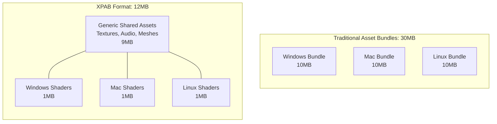

# XPAB (Cross-Platform Asset Bundle)

`xpab` is a cross-platform asset bundle format for Unity modding in C#.

### The Problem

Unity's native asset bundle system is inherently flawed for modding: if a game exists on multiple platforms (Windows, Mac, Linux, Android, etc), mod sizes bloat massively in an attempt to maintain compatibility because assets must be duplicated and compiled for each specific target.

This file type isn't perfect, it cannot be *truly* platform agnostic because engine-specific assets like shaders require specific instruction sets. This project aims to drastically reduce mod size bloat by isolating platform dependent data and generalizing everything else.

### Example (Hypothetical)
Say we have an asset bundle that is 10MB, of which 1MB is shaders. The target game runs on Windows, Mac, and Linux.

Normally, to support all platforms, the modder must embed three separate 10MB bundles. The mod's size balloons to **30MB** (excluding other data within the dll, like code).

If an `.xpab` file is used instead, the 9MB of generic assets (textures, audio, meshes) are stored once, alongside the three 1MB platform-specific shader bundles. The resulting mod size is **12MB** (9 + 1 + 1 + 1). That's a 60% reduction in file size!



---

## Building the Project

Due to the nature of the Unity modding scene, where games run on vastly different engine versions and use different interop libraries, I cannot provide pre-compiled, versioned releases. You must compile the project yourself against the specific DLLs of your target game and mod loader.

There are pre-configured (and gitignored) reference folders in the root folder where you can drop your target game and mod loader's DLLs.

### Configuration

The project has two build properties to make use of when compiling the project.
- `ModLoader`: Choose between `None` (Standalone, useful for if you want to load it yourself), `BepInEx`, `MelonLoader` and `Custom` (for non-conventional mod loaders, you must write the initialisation logic yourself for this target in a gitignored `XPABCore.Custom.cs` file). This lets the asset reader to be loaded either manually, or by the mod loader it's compiled against.
- `CompileTarget`: Choose between `Mono` and `Il2Cpp` when compiling the project. This corresponds to the scripting backends of Unity with the same name. There are key differences between the two, so it's important that asset creation match the backend exactly lest you feel the wrath of the engine.

When building the project, either set the values in the `csproj` like this: `<PropertyName>Value</PropertyName>`\
Or pass them into the build command like this: `/p:PropertyName=Value`

> Note: Unity 6.7+ ships with CoreCLR and has begun deprecating Mono, and most mod loaders already do so as well. The `Mono` compile target still works since CoreCLR is just an upgraded version of it.

### Prerequisites
You need the following for the project to be usable:
- An editor version that supports netstandard2.1 plugins
- A game made using that same version
- .NET 10+ SDK (since the project uses syntax from newer versions of C#)

### DLL References

Here are the libraries you need to extract and place into their respective folders:

`UnityEditor` (Found in: `[Editor Installation]/Editor/Data/Managed/`):
- `UnityEditor.dll`
- `UnityEditor.CoreModule.dll` (only if some methods are missing)

`UnityMono` (Found in: `[Game Installation]/[GameName]_Data/Managed/`):
- `UnityEngine.dll`
- `UnityEngine.AnimationModule.dll`
- `UnityEngine.AssetBundleModule.dll`
- `UnityEngine.AudioModule.dll`
- `UnityEngine.CoreModule.dll`
- `UnityEngine.ImageConversionModule.dll`
- `UnityEngine.TextRenderingModule.dll`
- `UnityEngine.VideoModule.dll`
- `Unity.TextMeshPro.dll`

`UnityIl2Cpp` (Found in: `[Game Installation]/BepInEx/interop/`, `[Game Installation]/BepInEx/core/` or `[Game Installation]/MelonLoader/Il2CppAssemblies/`)
- All the `UnityEngine.*` and `Unity.*` DLLs listed in the Mono section above.
- `Il2CppInterop.Runtime.dll`
- `Il2Cppmscorlib.dll`

`MelonLoader` (Found in: `[Game Installation]/MelonLoader/net6/`)
- `MelonLoader.dll`

`BepInEx` (Found in: `[Game Installation]/BepInEx/core/`)
- `BepInEx.Core.dll`
- `BepInEx.Unity.Common.dll`
- `BepInEx.Unity.IL2CPP.dll` (for Il2Cpp games)
- `BepInEx.Unity.Mono.dll` (for Mono games)

For the `Custom` loader configuration, navigate to the relevant folders and copy the minimum required dlls into the `CustomLoader` folder.

For Il2Cpp or Mono specific dlls for the mod loader, they can be dropped into the `[Bep/Melon/Custom][Il2Cpp/Mono]` folder (also gitignored).

For any game-specific dlls, you can drop them into the gitignored `Game` folder. Any code relating to it can also be `Runtime` project's subfolder with the same name.

Forewarning: Only copy over the minimum required dlls (above mentioned + any few extra dlls that the build process might require) to ensure an optimal development experience. Adding extra only serves to bloat your project for no added benefit.

You can also use the nuget package equivalent of any of the above dll sets, but I find it easier to do it manually instead.

---

## Using The Project
> This is a concept, as the project hasn't reached this level of completion yet.

The project comes with an Editor dll (the serialiser) for you to drop into your editor to begin compiling, and a Runtime dll (the deserialiser) for you to load into BepInEx/MelonLoader/any custom mod loader (can be loaded by either) and get started with loading assets.

You first start by [building the project](#building-the-project).

Then, you drop the `XPAB.Editor.dll` file anywhere in your plugins folder in your unity project. Drop the `XPAB.Runtime.dll` file in the location that's best for the use case (manual/mod loading).

### In The Editor

The editor dll provides you with two actions: `Create Config` (Project Context Menu) and `Build Bundles` (Top Toolbar).

You can create an `XPABConfig` instance using the "Create Config" context action in the "XPAB" section. You can create multiple config; each instance corresponds to a unique XPAB file.

Once you set the file name and target platforms in the config, you must mark the assets you want to bundle with a label (just like how you would when building normal asset bundles).

Once that is over, simply head over to the toolbar menu, and under the "XPAB" header, you can select "Build Bundles" action. This will build the bundles as needed.

### In The Runtime

You can ship the bundle however you'd like. Using the appropriate load method, you can load an XPAB file:
```cs
var assembly = Assembly.GetExecutingAssembly(); // Or however else you retrieve the reference to your dll
var path = /* Path to your asset */;
var bundle = XPAssetBundle.LoadFromAssembly(path, assembly, shouldUnloadOnDispose); // shouldUnloadOnDispose is used to delete assets when the bundle itself is unloaded
 // Also has alternatives: LoadFromMemory(Stream, bool), LoadFromMemory(byte[], bool), LoadFromAssembly(string, bool) and LoadFromFile(string, bool)
var someText = bundle.LoadAsset<TextAsset>("someText"); // You can also specify the full path, and the file extension is optional

bundle.Unload(); // Unloads the assets, also does the same on disposal
```

After that, the ball is in your court.

---

## The Binary Format

Currently, this is the planned binary format of the `xpab` file. Feel free to suggest improvements until it is finalized:

```text
-- Header
["XPAB"]                (String)  -- Prefix-less ASCII

[Bundle Name]           (String)  -- ULEB128 prefixed UTF-8

-- Embedded Unity bundles for assets that cannot be made platform agnostic
[Target Count]          (ULEB128)

  [Target ID]           (ULEB128) -- Enum
  [File Bytes]          (Byte[])  -- ULEB128 prefixed
  -- Repeats per platform target

-- String pool to avoid repeated strings, compressed using Brotli
[String Count]          (ULEB128)

  [String]              (String)  -- Future string writes will write a packed index instead of the actual string itself

[Master TOC Pos]        (INT64)

[Asset Settings]        (Variable)

  -- Asset Groups (Chunked by asset type)
  [Asset Group TOC Pos] (INT64)

    -- Assets
    [Asset Metadata]    (Variable)
    [File Bytes]        (Byte[])  -- Only serialised if any; ULEB128 prefixed
    -- Repeats per asset

  -- Asset Group Table of Contents
  [Asset Count]         (ULEB128)

    -- Asset Entry
    [Path]              (ULEB128)
    [File Name]         (ULEB128)
    [File Extension]    (SLEB128) -- Refers to the index in the Master TOC's file extension array, -1 for no extension
    [Asset Pos]         (INT64)
    -- Repeats per asset

  -- Repeats per asset type group

-- Master Table of Contents
[Type Count]            (ULEB128)

  -- Group Entry
  [Type ID]             (ULEB128) -- Enum
  [Group Pos]           (INT64)
  -- Repeats per asset type

-- Footer
["BAPX"]                (String)  -- Prefix-less ASCII
[Checksum]              (Byte[])  -- Prefix-less SHA-256
```

The file will be little endian.

---

## TODO
> In no particular order

- [x] Set up project and configurations
- [x] Set up build options in Editor project
- [x] Handle asset bundles
  - [x] Building
  - [x] Writing to file
  - [x] Reading from file
- [ ] Handle string pools
  - [ ] Writing to file
  - [ ] Reading from file
- [ ] Handle serialisation and deserialisation of assets (see matrix below)
- [x] Add checksum behaviour
  - [x] Serialise the checksum
  - [x] Check and compare on read
- [ ] Finalise binary
- [ ] Test
- [ ] Update README with actual numbers from tests

| Asset Type                        | Serialisable | Deserialisable |
| --------------------------------- | ------------ | -------------- |
| `TextAsset`                       | ✅           | ✅             |
| `BinaryAsset`                     | ✅           | ✅             |
| `AudioClip`                       | ✅           | ✅             |
| `Texture2D`                       | ✅           | ✅             |
| `Shader`                          | 🚧           | ❌             |
| `Mesh`                            | ❌           | ❌             |
| `VideoClip`                       | ❌           | ❌             |
| `Font`                            | ❌           | ❌             |
| `TMP_FontAsset`                   | ❌           | ❌             |
| `Material`                        | ❌           | ❌             |
| `Sprite`                          | ❌           | ❌             |
| `AnimationClip`                   | ❌           | ❌             |
| Data configs (`ScriptableObject`) | ❌           | ❌             |
| Prefabs (`GameObject`)            | ❌           | ❌             |

✅ = Supported\
🚧 = In Progress\
❌ = Not yet implemented/Researching

---

This project is a work-in-progress! Feel free to contribute! Check back frequently for updates!

---

## License

This project is provided under the [MIT license](LICENSE).
